<div align="center">

<picture>
  <source media="(prefers-color-scheme: dark)" srcset="assets/banner.svg">
  <source media="(prefers-color-scheme: light)" srcset="assets/banner-light.svg">
  
</picture>

<picture>
  <source media="(prefers-color-scheme: dark)" srcset="assets/typing.svg">
  <source media="(prefers-color-scheme: light)" srcset="assets/typing-light.svg">
  
</picture>

<picture>
  <source media="(prefers-color-scheme: dark)" srcset="assets/stack.svg">
  <source media="(prefers-color-scheme: light)" srcset="assets/stack-light.svg">
  
</picture>

</div>

<p align="center">
<picture>
  <source media="(prefers-color-scheme: dark)" srcset="assets/divider.svg">
  <source media="(prefers-color-scheme: light)" srcset="assets/divider-light.svg">
  
</picture>
</p>

# Гендальф — автоматическая обработка писем из сканов в Word

> **Интерактивная сцена:** [`docs/index.html`](docs/index.html) — письма летят к курсору и сортируются (после включения GitHub Pages: *Settings → Pages → Branch → `/docs`*).

## О проекте

Веб-приложение на **Django** для локальной сети. Пользователь загружает скан письма (PDF), система
преобразует его в Word-документ (текстовые PDF разбираются напрямую, сканы распознаются OCR Tesseract,
русский + английский). Скан и документ показываются рядом, документ можно править и сохранить как `.docx`
на свой компьютер. Все сохранения попадают в общий реестр «СКАНЫ» с фильтрами и поиском.

### Как работает преобразование

* **Всё лежит там же, где в оригинале.** Из PDF берётся не просто текст, а геометрия страницы: положение каждого слова, шрифт, размер,
  жирный/курсив. По ней восстанавливается вёрстка: центрированная шапка, «реквизиты слева / адресат справа», красная строка и выравнивание
  по ширине, подпись «должность — ФИО» на одной строке, интервалы между блоками, подчёркивание под шапкой, логотипы и печати (картинки
  поверх текста остаются на своих местах). Поля и размер страницы Word берутся из оригинала, поэтому отступы совпадают.
* **Таблицы остаются таблицами** — в Word создаются настоящие таблицы с теми же колонками, строками и объединёнными ячейками (colspan/rowspan):
  * с полной сеткой линий;
  * с частью линий (рамка, только горизонтальные линии, линия под шапкой) — границы повторяют оригинал по каждой стороне ячейки;
  * без линий вообще (колонки выровнены пробелами) — таблица без границ; заливка шапки и «зебра» сохраняются.
* Страницы с текстовым слоем разбирает PyMuPDF (слова, шрифты, линии и заливки из векторной графики).
* Страницы-сканы — связка **OCRmyPDF + Tesseract**:
  1. OCRmyPDF определяет ориентацию каждой страницы-скана (OSD) и разворачивает перевёрнутые и лежащие на боку листы; текстовые
     страницы документа он не трогает (`letters/ocrprep.py`);
  2. выравнивание наклона (до ±4°) → поиск линий таблиц (numpy) и их стирание → Tesseract (`rus+eng`, LSTM, 300 dpi) —
     слова с точными рамками, а затем отдельный проход по ячейкам таблиц. Эти данные нужны для вёрстки, поэтому текстовый слой OCRmyPDF
     не используется: он подготавливает страницу, а распознаёт Tesseract напрямую.
  Если OCRmyPDF или Ghostscript не установлены либо шаг не удался, преобразование продолжается без него (в окне появится предупреждение).
  Кегль определяется по ширине строки (строки в Word получаются той же ширины, что в скане, и переносятся так же), жирность — по толщине штриха;
  мелкие ячейки таблиц (номера, количество) распознаются отдельно, поэтому «1, 2, 3» не превращаются в мусор.
* Результат правится в окне (оно показывает страницу с теми же полями и отступами); при сохранении собирается `.docx`
  (Times New Roman/Arial по оригиналу, размеры и поля страницы как в оригинале, разрывы страниц сохраняются).

Качество OCR зависит от скана: чистые сканы 300 dpi распознаются почти безошибочно; печати
и рукописный текст нужно вычитывать в окне редактирования. На сканах картинки (логотипы, печати) не переносятся — только текст и таблицы.

### Что лежит в репозитории

| Путь | Назначение |
|---|---|
| `gendalf/`, `letters/`, `templates/` | код приложения |
| `db.sqlite3` | готовая база SQLite: таблицы и пользователь `admin/admin` (создаётся миграцией `letters/migrations/0002_create_admin.py`) |
| `vendor/wheels/` | **все Python-библиотеки** (Windows x64 и Linux x64, Python 3.11/3.12) — установка без интернета |
| `tessdata/` | модели Tesseract: `rus`, `eng` и `osd` (определение ориентации страницы для OCRmyPDF) — доустанавливать не нужно |
| `requirements.txt` | список библиотек |
| `setup.bat` / `setup.sh` | установка; `run.bat` / `run.sh` — запуск |

<p align="center">
<picture>
  <source media="(prefers-color-scheme: dark)" srcset="assets/divider.svg">
  <source media="(prefers-color-scheme: light)" srcset="assets/divider-light.svg">
  
</picture>
</p>

## Возможности

* Авторизация (логины/пароли — в SQLite, `db.sqlite3`). Администратор: **`admin` / `admin`** (смените пароль после запуска).
  Новых пользователей добавляет администратор: меню «Пользователи» (`/admin/`).
* **Загрузка PDF-писем**: слева PDF-скан, справа редактируемый Word-документ (жирный/курсив/подчёркивание,
  выравнивание, списки, заголовки). Кнопка **«Сохранить WORD файл»** → окно: название файла, № входящего письма,
  дата обработки, папка → файл записывается **на компьютере пользователя**, запись попадает в «СКАНЫ».
* **СКАНЫ**: таблица (№ п/п, название, № входящего, дата сохранения, дата обработки, путь-ссылка),
  фильтр по каждому столбцу и поиск слова по всем столбцам сразу.

<p align="center">
<picture>
  <source media="(prefers-color-scheme: dark)" srcset="assets/divider.svg">
  <source media="(prefers-color-scheme: light)" srcset="assets/divider-light.svg">
  
</picture>
</p>

## Быстрый старт

### Что нужно для запуска (на сервере — компьютере в сети)

1. **Python 3.11 или 3.12** (64-бит). На Windows при установке поставьте галочку *Add Python to PATH*.
2. **Tesseract OCR** (движок распознавания; это отдельная программа, а не библиотека Python):
   * Windows: установщик [UB-Mannheim/tesseract](https://github.com/UB-Mannheim/tesseract/wiki)
     (путь по умолчанию `C:\Program Files\Tesseract-OCR`). Языки выбирать не обязательно — они берутся из папки
     `tessdata/` проекта. Из папки по умолчанию `C:\Program Files\Tesseract-OCR` он подхватывается автоматически; если установлен в другое место — в `run.bat` раскомментируйте и поправьте строку `set TESSERACT_CMD=...`.
   * Ubuntu/Debian: `sudo apt install tesseract-ocr`
3. **Ghostscript** (нужен OCRmyPDF — он готовит сканы перед распознаванием; без него система работает, но не разворачивает
   перевёрнутые и повёрнутые на 90° листы):
   * Windows: установщик [ghostscript.com](https://ghostscript.com/releases/gsdnld.html) (64-бит, путь по умолчанию)
   * Ubuntu/Debian: `sudo apt install ghostscript` (необязательно ещё `unpaper` — для чистки сканов, см. ниже)
4. Больше ничего: Django, PyMuPDF, OCRmyPDF, python-docx, waitress и остальное ставится из `vendor/wheels`.

Пользователям на своих компьютерах нужен только современный браузер (Chrome/Edge/Firefox).

### Алгоритм запуска

**Windows**
1. Скопируйте папку проекта на сервер.
2. Дважды щёлкните `setup.bat` — создаст окружение `.venv`, установит библиотеки из `vendor\wheels`,
   применит миграции БД и соберёт статику.
3. Дважды щёлкните `run.bat` — сервер запустится на порту 8000.

**Linux / macOS**
```bash
./setup.sh      # окружение + библиотеки + БД
./run.sh        # запуск
```

**Вручную (любая ОС)**
```bash
python -m venv .venv
.venv/bin/pip install --no-index --find-links vendor/wheels -r requirements.txt   # Windows: .venv\Scripts\pip
.venv/bin/python manage.py migrate
.venv/bin/python manage.py collectstatic --noinput
.venv/bin/python waitress_run.py
```

**Открытие из сети.** Узнайте IP сервера (`ipconfig` / `ip a`), например `192.168.1.10`. Пользователи открывают
`http://192.168.1.10:8000`. Если страница не открывается — разрешите входящий TCP-порт 8000 в брандмауэре сервера
(Windows: «Брандмауэр → Правила для входящих подключений → Создать правило → Порт 8000»).
Порт и адрес меняются переменными `GENDALF_PORT`, `GENDALF_HOST`.

Первый вход: логин `admin`, пароль `admin`. Сразу смените пароль (`/admin/` → Пользователи → admin).

### Настройки (переменные окружения, все необязательны)

| Переменная | По умолчанию |
|---|---|
| `GENDALF_PORT` / `GENDALF_HOST` | `8000` / `0.0.0.0` |
| `GENDALF_SECRET_KEY` | задайте свой длинный случайный ключ на рабочем сервере |
| `GENDALF_TZ` | `Europe/Moscow` |
| `GENDALF_OCR_LANGS` | `rus+eng` |
| `GENDALF_OCR_DPI` | `300` (выше — точнее, но медленнее) |
| `TESSERACT_CMD` | полный путь к `tesseract.exe`, если его нет в PATH |
| `GENDALF_OCRMYPDF` | `auto` — использовать OCRmyPDF, если он есть и сработал (по умолчанию); `on` — обязательно, иначе ошибка; `off` — выключить |
| `GENDALF_OCRMYPDF_DESKEW` | `1` — выравнивать наклон силами OCRmyPDF (по умолчанию `0`: свой алгоритм не портит ровные сканы) |
| `GENDALF_OCRMYPDF_CLEAN` | `1` — чистка скана через unpaper (по умолчанию `0`) |
| `GENDALF_OCRMYPDF_TIMEOUT` | секунд на подготовку документа, по умолчанию `900` |
| `GENDALF_CSRF_ORIGINS` | адреса через запятую (нужно только за прокси/по HTTPS) |

### Безопасность

Сервис рассчитан на закрытую локальную сеть (HTTP без шифрования). Смените пароль `admin`, задайте
`GENDALF_SECRET_KEY`, не публикуйте порт в интернет.

<p align="center">
<picture>
  <source media="(prefers-color-scheme: dark)" srcset="assets/divider.svg">
  <source media="(prefers-color-scheme: light)" srcset="assets/divider-light.svg">
  
</picture>
</p>

## Использование

После запуска откройте адрес сервера в браузере, войдите (`admin` / `admin`, пароль сразу смените), загрузите PDF-письмо — слева появится скан, справа редактируемый Word-документ; кнопка **«Сохранить WORD файл»** добавляет запись в реестр **«СКАНЫ»** (подробности — в разделе «Возможности»).

### Как сохраняется файл на машину пользователя

Сервер собирает `.docx`, а **запись файла выполняет браузер пользователя**:

* Chrome/Edge на `localhost` или по HTTPS — кнопка «Выбрать папку…» открывает системный диалог, файл пишется прямо в папку.
* Обычный доступ по `http://IP-сервера:8000` — браузеры не дают выбрать папку на небезопасных адресах; тогда файл
  скачивается браузером (в «Загрузки» или с запросом места — включите в настройках браузера
  «Всегда спрашивать, куда сохранять файлы»). Чтобы получить системный диалог и по http, в Chrome/Edge откройте
  `chrome://flags/#unsafely-treat-insecure-origin-as-secure`, добавьте `http://IP-сервера:8000` и включите параметр.

**Путь в таблице «СКАНЫ».** Браузер не сообщает полный путь выбранной папки, поэтому в окне сохранения есть поле
«Папка» (запоминается) — впишите путь (`C:\Письма` или `\\сервер\общая\Письма`). В реестр попадёт
`путь\название.docx` в виде ссылки. Браузеры не открывают `file://` со страниц по http, поэтому клик по ссылке
ещё и копирует путь в буфер обмена — его можно вставить в «Проводник».

<p align="center">
<picture>
  <source media="(prefers-color-scheme: dark)" srcset="assets/divider.svg">
  <source media="(prefers-color-scheme: light)" srcset="assets/divider-light.svg">
  
</picture>
</p>

## Roadmap

Идеи для развития выведены из ограничений, описанных выше. Это направления, а не обязательства.

- [ ] Таблицы без линий сетки (только выравнивание пробелами) — сейчас распознаются как обычный текст.
- [ ] Рукописный текст и печати — сейчас такие места нужно вычитывать в окне редактирования.
- [ ] HTTPS «из коробки» — сейчас сервис рассчитан на закрытую сеть по HTTP, а выбор папки в браузере работает только на `localhost`/HTTPS.
- [ ] Автотесты конвертера и представлений (`letters/tests.py` пока пуст).

<p align="center">
<picture>
  <source media="(prefers-color-scheme: dark)" srcset="assets/divider.svg">
  <source media="(prefers-color-scheme: light)" srcset="assets/divider-light.svg">
  
</picture>
</p>

## Contributing

1. Сделайте форк и создайте ветку под свою задачу.
2. Запустите проект локально в режиме разработки (команда ниже) и проверьте изменение руками на PDF-письме и скане.
3. Откройте pull request с описанием: что изменено и как проверить.

**Запуск для разработки**

```bash
GENDALF_DEBUG=1 .venv/bin/python manage.py runserver
.venv/bin/python manage.py test letters      # тесты преобразования (таблицы, вёрстка, скан — нужен Tesseract)
```

Код преобразования: `letters/converter.py` (чтение PDF и OCR), `letters/layout.py` (восстановление вёрстки), `letters/docxbuild.py` (HTML → DOCX).

Визуальные ассеты (`assets/*.svg`) собираются генератором — не правьте SVG руками, а меняйте цвета и тексты в `tools/visuals/*.py` и запускайте `python3 tools/build_visuals.py` (подробности — в [`tools/README.md`](tools/README.md)).

<p align="center">
<picture>
  <source media="(prefers-color-scheme: dark)" srcset="assets/divider.svg">
  <source media="(prefers-color-scheme: light)" srcset="assets/divider-light.svg">
  
</picture>
</p>

## License

Файл лицензии в репозиторий пока не добавлен, поэтому права на код сохраняются за его автором(ами). Для использования или распространения свяжитесь с владельцем репозитория ([RunToLife](https://github.com/RunToLife)).

<div align="center">

<picture>
  <source media="(prefers-color-scheme: dark)" srcset="assets/footer.svg">
  <source media="(prefers-color-scheme: light)" srcset="assets/footer-light.svg">
  
</picture>

</div>
